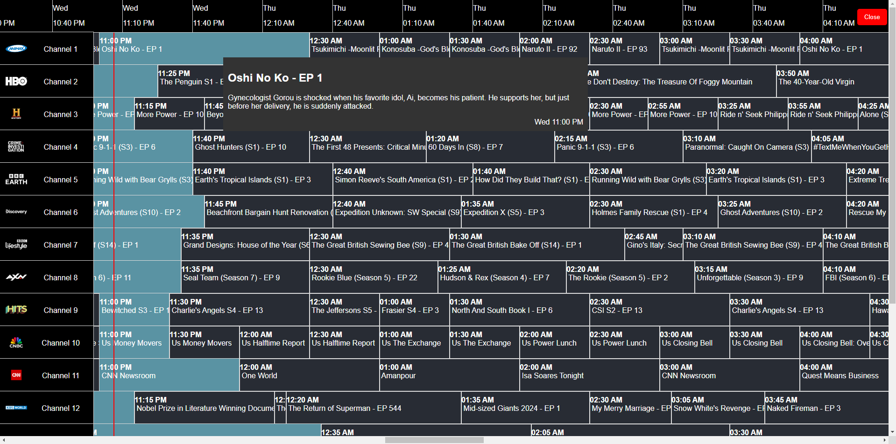
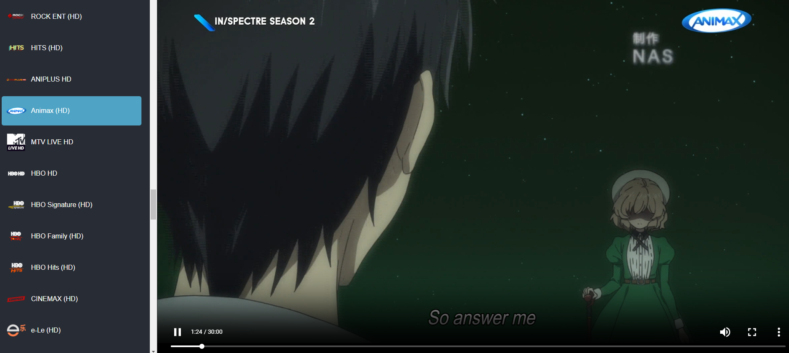
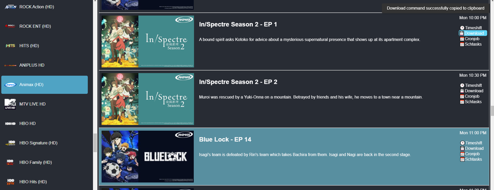
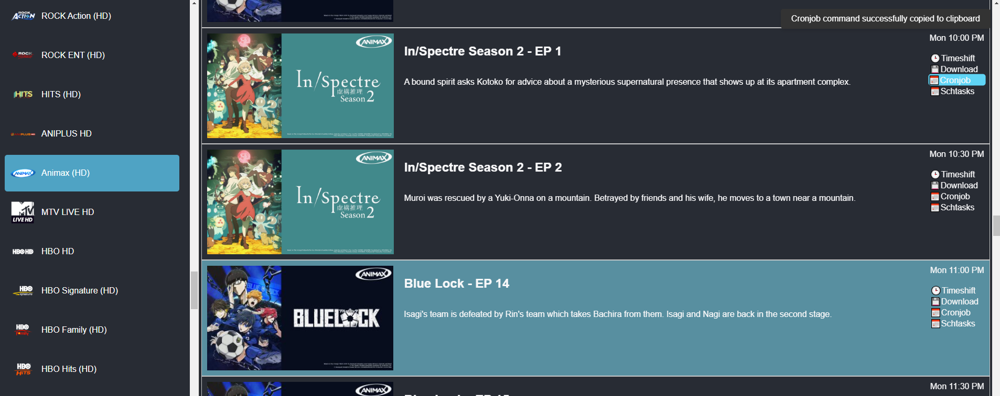
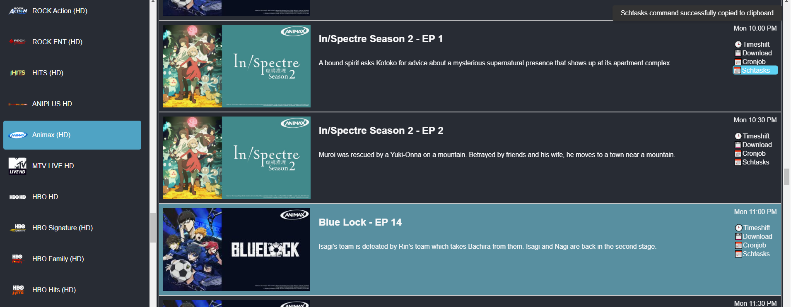

# html-iptv-player

## Overview

HTML IPTV Player with EPG viewer for M3U8 playlist

https://dbghelp.github.io/player.html?file=<link to playlist.m3u8\>

https://dbghelp.github.io/player.html?file=https://dbghelp.github.io/playlist.m3u8

## Features

- Mouse over channel logo to view EPG for specific channel (with thumbnail images from epg.xml)
- Click on EPG button to view EPG for all channels (Traditional EPG)
- Supports different key formats (hex, base64, multiple keys)
- Supports DASH, HLS, MSS (using shaka player)
- Auto assign `tvg-id` from `epg.xml` to `tvg-id` in `playlist.m3u8` (when missing)

V2 update:
- Added timeshift feature to watch previously aired TV programmes
- Added download feature to download previously aired TV programmes
- Added download feature to download future TV programmes (with cronjob/schtasks)
- Added support for compressed file formats (`.gz` and `.zip` files)
- Added support for local file upload
- Added error handling for malformed EPGs


## Screenshots
*Channel logos used for illustration purpose only




## Sample M3U8 playlist format
```
#EXTM3U url-tvg="https://raw.githubusercontent.com/dbghelp/StarHub-TV-EPG/refs/heads/main/starhub.xml, https://raw.githubusercontent.com/dbghelp/mewatch-EPG/refs/heads/main/mewatch.xml" refresh="3600"

#EXTINF:-1  tvg-id="532" tvg-logo="https://poster.starhubgo.com/Linear_channels2/532_1920x1080_HTV.png?w=272", Channel 1
#KODIPROP:inputstream.adaptive.license_type=clearkey
#KODIPROP:inputstream.adaptive.license_key=302f80dd411e4886bca5bb1f8018a024:15b2aaf906ebec6309d40f91289127b8
https://media.axprod.net/TestVectors/Cmaf/protected_1080p_h264_cbcs/manifest.mpd

#EXTINF:-1  tvg-id="601" tvg-logo="https://poster.starhubgo.com/Linear_channels2/601_1920x1080_HTV.png?w=272", Channel 2
#KODIPROP:inputstream.adaptive.license_type=clearkey
#KODIPROP:inputstream.adaptive.license_key={ "keys":[ { "kty":"oct", "k":"FbKq+Qbr7GMJ1A+RKJEnuA==", "kid":"MC+A3UEeSIa8pbsfgBigJA==" } ], "type":"temporary" }
https://media.axprod.net/TestVectors/Cmaf/protected_1080p_h264_cbcs/manifest.mpd

#EXTINF:-1  tvg-id="401" tvg-logo="https://poster.starhubgo.com/Linear_channels2/401_1920x1080_HTV.png?w=272", Channel 3
#KODIPROP:inputstream.adaptive.license_type=clearkey
#KODIPROP:inputstream.adaptive.license_key={ "keys":[ { "kty":"oct", "k":"FbKq+Qbr7GMJ1A+RKJEnuA==", "kid":"MC+A3UEeSIa8pbsfgBigJA==" } , { "kty":"oct", "k":"FbKq+Qbr7GMJ1A+RKJEnuA==", "kid":"MC+A3UEeSIa8pbsfgBigJA==" } ], "type":"temporary" }
https://media.axprod.net/TestVectors/Cmaf/protected_1080p_h264_cbcs/manifest.mpd
```
## Test out your epg.xml

https://github.com/dbghelp/html-epg-viewer

https://dbghelp.github.io/epg.html?file=<link to epg.xml\>

[https://dbghelp.github.io/epg.html?file=https://raw.githubusercontent.com/dbghelp/mewatch-EPG/refs/heads/main/mewatch.xml](https://dbghelp.github.io/epg.html?file=https://raw.githubusercontent.com/dbghelp/mewatch-EPG/refs/heads/main/mewatch.xml)

## Create your own IPTV web app in 5 minutes

1. Download `create_your_own_iptv_webapp.html` from this repository
2. Open the file in notepad, search for `m3u8Link='https://dbghelp.github.io/playlist.m3u8` and replace the hardcoded playlist.m3u8 link to your m3u8 playlist link
3. Rename the file to what you like
4. Find a static html hosting service and upload the html file (or use python -m http.server to host locally)

## CORS issue

Here's a few ways to solve it:
- Try to use incognito mode (may work)
- Find a web browser extension for this
- Use a CORS proxy
- Use other alternative links

## Timeshift to watch previously aired TV programmes





Often, platforms providing livestream feeds for IPTV providers include a timeshift feature by adding additional HTTP parameters. However, this feature is typically not made available to subscribers of the IPTV service. We can access this feature by injecting the correct HTTP parameters ourselves.

Here are the platforms I have discovered, along with their HTTP parameter formats:

1. **Verimatrix**  
   Tested with the following IPTV providers, and confirmed that it works: Singtel, Telefónica, Telus

   **MPD URL pattern and example HTTP parameters:**
    <pre>https://example.com/1234/<span style="color: red;">vxfmt=dp</span>/manifest.mpd?xxxx=xxxx&start_time=2024-12-30T15:00:00Z&end_time=2024-12-30T16:00:00Z</pre>

2. **Broadpeak**  
   Tested with the following IPTV providers, and confirmed that it works: Starhub, Magenta TV

   **MPD URL pattern and example HTTP parameters:**
    <pre>https://example.com/bpk-tv/xxxx/output/manifest.mpd?begin=20241230T153000Z&end=20241230T170000Z</pre>

3. **AWS Media Services**  
   Tested with the following IPTV providers, and confirmed that it works: mewatch

   **MPD URL pattern and example HTTP parameters:**
    <pre>https://example.com/out/v1/8928c1140dd354c5be06db78d686eada/manifest.mpd?start=1735574400&end=1735578000</pre>

If the mpd url of your channel is not 1, 2 or 3, then this format is applied:

`?start=1735574400&end=1735578000`


## Download previously aired TV programmes

Ensure that you can timeshift to watch the previously aired TV programme first.

Click on the download button to get the download command:


Example download command generated:

`
N_m3u8DL-RE --check-segments-count false "https://example.com/manifest.mpd?xxxxxx=xxxxxx&start_time=2024-12-30T14:00:00Z&end_time=2024-12-30T14:30:00Z" -M format=mkv --save-name "InSpectre Season 2  EP 1" --key 00000000000000000000000000000000:00000000000000000000000000000000
`

## Download future TV programmes

Click on the cronjob(linux) or schtasks(windows) button to get the cronjob/schtasks command:



Example cronjob (for linux) command generated:

`
echo 'N_m3u8DL-RE --check-segments-count false "https://example.com/manifest.mpd?xxxxxx=xxxxxx&start_time=2024-12-30T15:00:00Z&end_time=2024-12-30T15:30:00Z" -M format=mkv --save-name "Blue Lock  EP 14" --key 00000000000000000000000000000000:00000000000000000000000000000000 -sv best -sa all --save-dir "~/Videos"' > ~/Videos/download_Blue_Lock__EP_14.sh &&  chmod +x ~/Videos/download_Blue_Lock__EP_14.sh && (crontab -l 2>/dev/null; echo "35 23 30 12 1 cd ~/Videos && ~/Videos/download_Blue_Lock__EP_14.sh") | crontab -
`

Example schtasks (for windows) command generated:

`
echo N_m3u8DL-RE --check-segments-count false "https://example.com/manifest.mpd?xxxxxx=xxxxxx&start_time=2024-12-30T15:00:00Z&end_time=2024-12-30T15:30:00Z" -M format=mkv --save-name "Blue Lock  EP 14" --key 00000000000000000000000000000000:00000000000000000000000000000000 -sv best -sa all --save-dir "%USERPROFILE%\Videos" > "%USERPROFILE%\Videos\download_Blue_Lock__EP_14.bat" & schtasks /create /sc once /sd 30/12/2024 /st 23:35 /tn "Download Blue Lock  EP 14" /tr "cmd /c cd %USERPROFILE%\Videos & %USERPROFILE%\Videos\download_Blue_Lock__EP_14.bat"
`
## Setting up N_m3u8DL-RE

### 1. Download the ZIP File
1. Open your web browser and navigate to the following URL:  
   [Download N_m3u8DL-RE.zip](https://github.com/nilaoda/N_m3u8DL-RE/releases/download/v0.3.0-beta/N_m3u8DL-RE_v0.3.0-beta_win-x64_20241203.zip)
2. Save the file to your preferred location (e.g., the **Downloads** folder).

---

### 2. Extract the ZIP File
1. Locate the downloaded file:  
   `N_m3u8DL-RE_v0.3.0-beta_win-x64_20241203.zip`.
2. Right-click on the ZIP file and select **"Extract All"**.
3. Choose a location for the extracted files (e.g., the **Downloads** folder) and click **Extract**.
4. After extraction, locate the `N_m3u8DL-RE.exe` file in the extracted folder.

---

### 3. Create the `C:\Tools` Folder
1. Open **File Explorer**.
2. Navigate to the `C:` drive.
3. Right-click on an empty space in the window and select **"New" > "Folder"**.
4. Name the folder **Tools**.

---

### 4. Move `N_m3u8DL-RE.exe` to `C:\Tools`
1. Go to the folder where `N_m3u8DL-RE.exe` was extracted.
2. Right-click on `N_m3u8DL-RE.exe` and select **"Cut"**.
3. Navigate to the `C:\Tools` folder.
4. Right-click inside the `C:\Tools` folder and select **"Paste"**.

---

### 5. Add `C:\Tools` to the PATH Environment Variable
1. Press `Win + S` and search for **Environment Variables**.  
   (Alternatively: Open **Control Panel** > **System and Security** > **System** > Click **Advanced System Settings** > Click **Environment Variables**.)
2. In the Environment Variables window:
   - Under **System Variables**, find and select the variable named **Path**.
   - Click the **Edit** button.
3. In the Edit Environment Variable window:
   - Click **New**.
   - Enter `C:\Tools`.
4. Click **OK** to close all dialog boxes.

---

### 6. Verify the Setup
1. Open **Command Prompt** (`Win + R`, type `cmd`, and press Enter).
2. Type `N_m3u8DL-RE.exe` and press Enter.
3. If the setup is successful, the program should run without errors.

---

